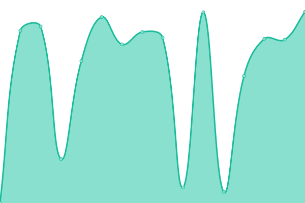
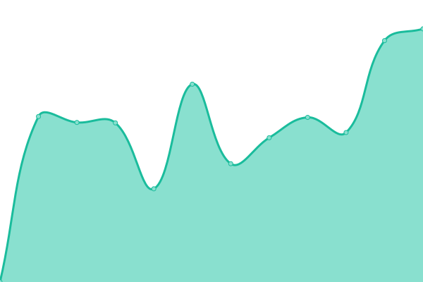
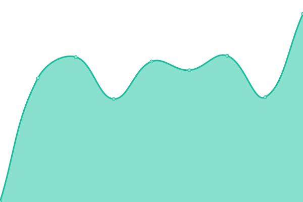
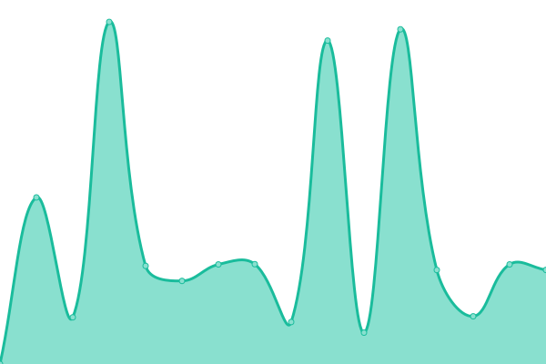

# [📈 Live Status](https://LucaBarbaLata.github.io/uptime): <!--live status--> **🟩 All systems operational**

This repository contains the open-source uptime monitor [Upptime](https://github.com/upptime/upptime).

<!--start: status pages-->
<!-- This summary is generated by Upptime (https://github.com/upptime/upptime) -->
<!-- Do not edit this manually, your changes will be overwritten -->
<!-- prettier-ignore -->
| URL | Status | History | Response Time | Uptime |
| --- | ------ | ------- | ------------- | ------ |
|  [Website](https://lucariki.top) | 🟩 Up | [website.yml](https://github.com/LucaBarbaLata/uptime/commits/HEAD/history/website.yml) | 

 2953ms
     
 | 

<a href="https://status.lucariki.top/history/website">83.41%</a>
    

|  [File Server](https://files.lucariki.top) | 🟩 Up | [file-server.yml](https://github.com/LucaBarbaLata/uptime/commits/HEAD/history/file-server.yml) | 

 2697ms
     
 | 

<a href="https://status.lucariki.top/history/file-server">98.71%</a>
    

|  [File Server (Backup)](https://lucariki.go.ro) | 🟩 Up | [file-server-backup.yml](https://github.com/LucaBarbaLata/uptime/commits/HEAD/history/file-server-backup.yml) | 

 1411ms
     
 | 

<a href="https://status.lucariki.top/history/file-server-backup">98.71%</a>
    

|  [Panel](https://panel.lucariki.top) | 🟩 Up | [panel.yml](https://github.com/LucaBarbaLata/uptime/commits/HEAD/history/panel.yml) | 

 7101ms
     
 | 

<a href="https://status.lucariki.top/history/panel">11.67%</a>
    

|  [Immich](https://immich.lucariki.top) | 🟩 Up | [immich.yml](https://github.com/LucaBarbaLata/uptime/commits/HEAD/history/immich.yml) | 

 1696ms
     
 | 

<a href="https://status.lucariki.top/history/immich">98.71%</a>
    

<!--end: status pages-->

[**Visit our status website →**](https://LucaBarbaLata.github.io/uptime)

## 📄 License

- Powered by: [Upptime](https://github.com/upptime/upptime)
- Code: [MIT](./LICENSE) © [Anand Chowdhary](https://anandchowdhary.com), supported by [Pabio](https://pabio.com)
- Data in the `./history` directory: [Open Database License](https://opendatacommons.org/licenses/odbl/1-0/)
